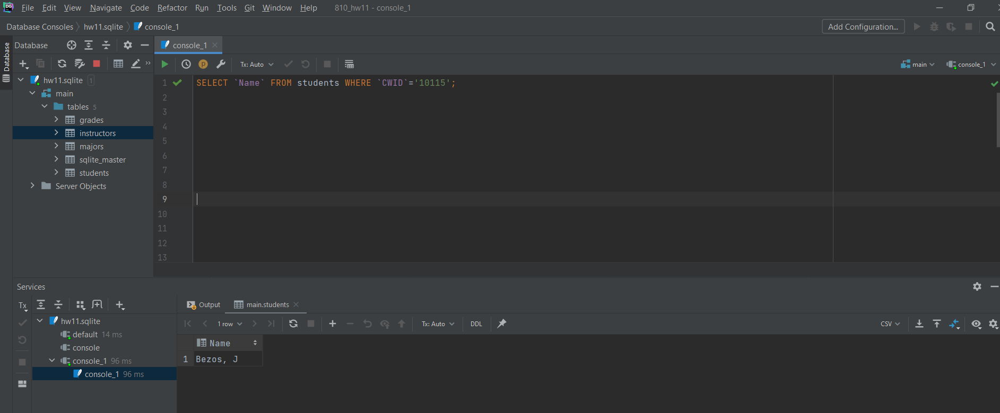
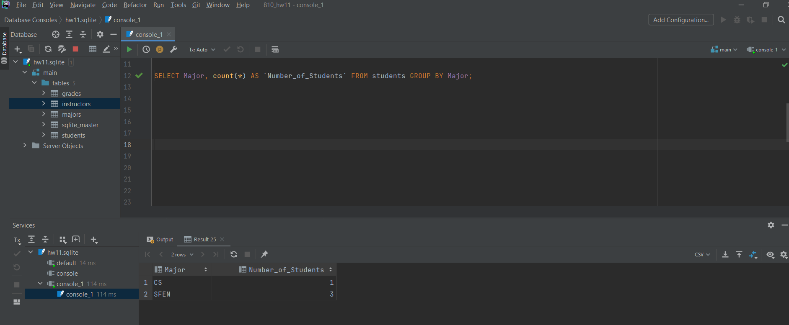
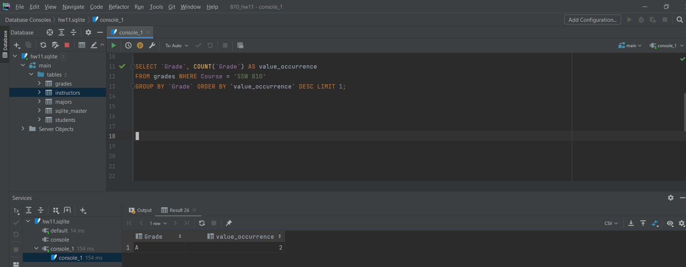
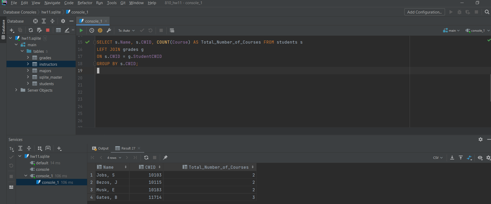
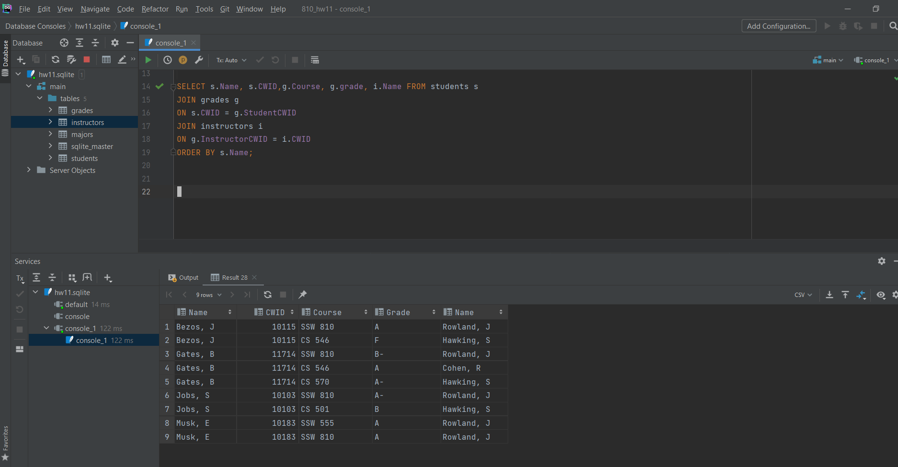

# HW11 Database Queries
Author: Viyeta Kansara\
CWID: 10473081

Screen dumps of **DataGRIP** to ***show queries and results*** for each of the following questions:

1. What is the name of the student with CWID='10115'   (NOTE: if you don't find any matching records then verify that the CWID has type TEXT in all four tables.   Integers don't match strings in SQL or Python.)
    ```
    SELECT Name FROM students WHERE CWID='10115';
    ```


2. What is the total number of students by major?  Hint:  you'll need count(*) and 'group by'.  See the slide on "Aggregate functions and GROUP BY".
    ```markdown
    SELECT Major, count(*) AS Number_of_Students FROM students GROUP BY Major;
    ```


3. What is the most frequent grade for SSW 810 across all students? 
    ```markdown
    SELECT Grade, COUNT(Grade) AS value_occurrence
    FROM grades WHERE Course = 'SSW 810'
    GROUP BY Grade ORDER BY value_occurrence DESC LIMIT 1;
    ```


4. Display the name and cwid of each student along with the total number of courses taken by the student.   Hint: You'll need to join the students and grades tables on StudentCWID and CWID. 
    ```markdown
    SELECT s.Name, s.CWID, COUNT(Course) AS Total_Number_of_Courses FROM students s
    LEFT JOIN grades g
    ON s.CWID = g.StudentCWID
    GROUP BY s.CWID;
    ```


5. Display each student's name,  CWID, course, grade, and the instructor's name  for all students and grades.  The result should be sorted by the student's name. Hint: You'll need to join the grades and students tables on StudentCWID and CWID and join the instructors table using the instructor's CWID.  E.g. Bezos, J, CWID 10115, earned an 'A' in SSW 810 taught by Rowland.
    ```markdown
    SELECT s.Name, s.CWID,g.Course, g.grade, i.Name FROM students s
    JOIN grades g
    ON s.CWID = g.StudentCWID
    JOIN instructors i
    ON g.InstructorCWID = i.CWID
    ORDER BY s.Name;
    ```
